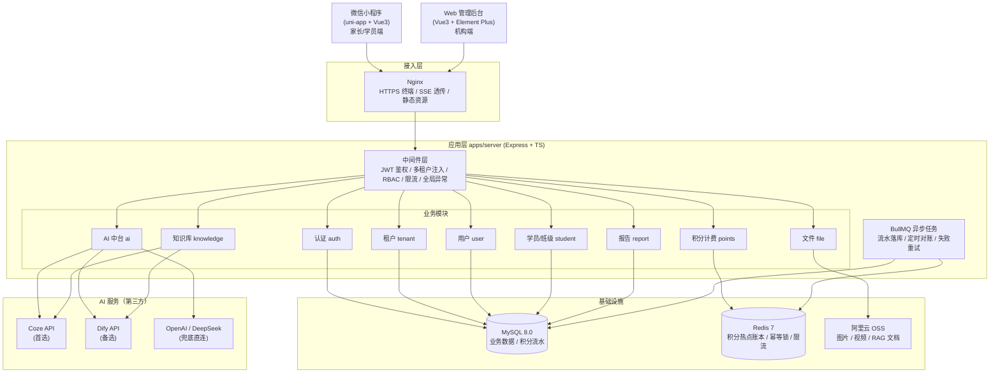
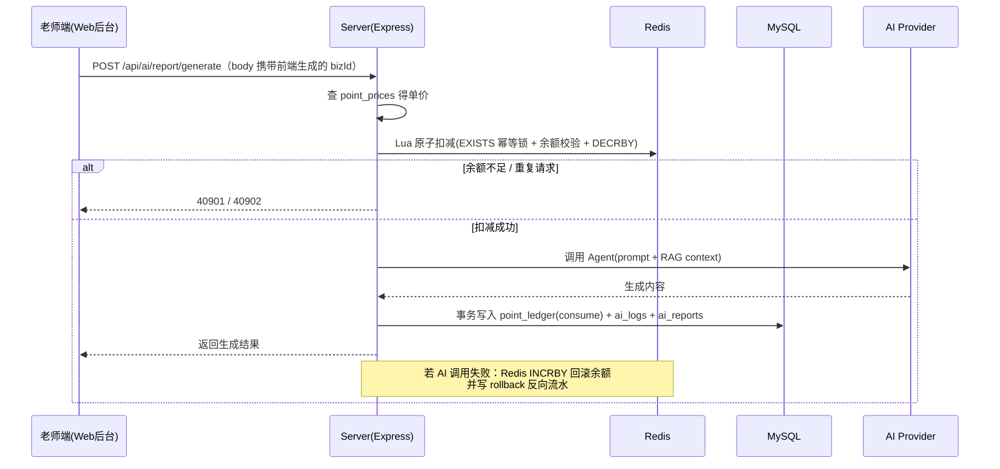

# ArtEdu AI 经营增长系统 MVP 开发计划（优化版）

> 本文件是项目的开发蓝图（System Prompt + Roadmap），供 AI IDE（Cursor / Windsurf / Claude Code / Trae）直接读取执行。
> 文件位于项目根目录 `plan.md`，是所有开发任务的唯一事实来源（Single Source of Truth）。

---

## 0. 项目概览

- **项目名称**：ArtEdu AI Growth System（舞蹈/艺术教培 AI 经营增长系统）
- **项目定位**：面向舞蹈/艺术教培机构的多租户 AI SaaS 系统，通过 AI 辅助机构生成课后点评、成长报告、招生文案、家长沟通话术，提升续费率与招生效率。
- **MVP 周期**：30 - 45 天（6 周）
- **MVP 形态**：微信小程序（家长/学员端）+ Web 管理后台（机构端）+ AI SaaS 中台（后端）
- **MVP 范围锁定**：机构管理后台 + 小程序 AI 点评/报告 + 积分计费 + RAG 知识库，其余全部二期
- **开发模式**：AI IDE 辅助全栈开发，人工负责架构决策、AI 调优、真实客户对接

---

## 1. 系统架构设计

### 1.1 总体架构图



### 1.2 请求链路与分层约定

```
请求 → Nginx → Express 中间件链(auth → tenant → rbac → ratelimit) → Router → Controller → Service → Prisma
```

| 层             | 职责                                          | 约定                 |
| :------------- | :-------------------------------------------- | :------------------- |
| **middleware** | 鉴权、租户上下文注入、角色守卫、限流          | 不写业务逻辑         |
| **controller** | 参数解析与校验（zod）、调用 service、组装响应 | 薄层，不含业务       |
| **service**    | 业务逻辑、事务编排、AI/积分调用               | 唯一写业务的地方     |
| **prisma**     | 数据访问，经租户扩展自动注入 tenantId         | 禁止绕过扩展手写 SQL |

### 1.3 统一响应与错误码

```json
// 成功
{ "code": 0, "message": "ok", "data": {} }
// 失败
{ "code": 40901, "message": "积分余额不足", "data": null }
```

| 错误码 | 说明                 |
| :----- | :------------------- |
| 0      | 成功                 |
| 40001  | 未登录或 token 失效  |
| 40003  | 无权限（角色不足）   |
| 40004  | 参数校验失败         |
| 40404  | 资源不存在           |
| 40901  | 积分余额不足         |
| 40902  | 重复请求（幂等拦截） |
| 50000  | 服务器内部错误       |
| 50901  | AI 服务调用失败      |

---

## 2. 技术栈选型

| 层级                | 技术选型                                               | 说明                                                                                            |
| :------------------ | :----------------------------------------------------- | :---------------------------------------------------------------------------------------------- |
| **后端 API + 中台** | Node.js (Express 4 + TypeScript)                       | REST API、SSE 流式输出、AI 调用、积分扣减                                                       |
| **ORM**             | Prisma 5                                               | schema 即文档，迁移由 `prisma migrate` 管理                                                     |
| **参数校验**        | zod                                                    | 请求体/查询参数校验，与 TS 类型联动                                                             |
| **Web 管理后台**    | Vue 3 + Vite + Element Plus + Pinia + Vue Router       | 机构端管理界面                                                                                  |
| **微信小程序**      | uni-app + Vue 3 + Pinia                                | 家长/学员端                                                                                     |
| **数据库**          | MySQL 8.0                                              | 租户、用户、学员、积分流水、AI 日志                                                             |
| **缓存/原子操作**   | Redis 7 (ioredis) + Lua 脚本                           | 积分并发扣减、限流、幂等锁、refresh token                                                       |
| **AI 能力**         | Coze / Dify API（首选）+ OpenAI / DeepSeek API（备用） | Agent、RAG 知识库、流式输出                                                                     |
| **文件存储**        | 阿里云 OSS（multer 直传）                              | 图片、视频、RAG 文档                                                                            |
| **异步任务**        | BullMQ（基于 Redis）                                   | 异步 AI 生成、积分对账、失败重试                                                                |
| **日志**            | pino + pino-http                                       | 结构化 JSON 日志输出到 stdout，由 Docker 日志驱动收集；生产可选接入阿里云 SLS 或 Loki + Grafana |
| **部署**            | Docker + Docker Compose + Nginx                        | 一键部署                                                                                        |
| **代码规范**        | ESLint + Prettier + Husky + Commitlint                 | 统一代码风格                                                                                    |

---

## 3. 项目目录结构（Monorepo）

```text
art-edu-ai/
├── apps/
│   ├── server/                       # Express + Prisma 后端 + AI SaaS 中台
│   │   ├── src/
│   │   │   ├── config/               # 环境配置加载（dotenv + zod 校验）
│   │   │   ├── middleware/           # auth / tenant / rbac / rateLimit / errorHandler
│   │   │   ├── modules/
│   │   │   │   ├── auth/             # 登录鉴权（微信 + 后台）：routes + controller + service
│   │   │   │   ├── tenant/           # 租户管理
│   │   │   │   ├── user/             # 用户/老师/家长管理
│   │   │   │   ├── student/          # 学员档案 + 班级
│   │   │   │   ├── ai/               # AI 中台
│   │   │   │   │   ├── providers/    # AiProvider 抽象 + coze/dify/openai 适配器
│   │   │   │   │   ├── prompts/      # Prompt 模板（按 agentType 组织）
│   │   │   │   │   └── sse.ts        # SSE 响应封装
│   │   │   │   ├── points/           # 积分账本（Lua 原子扣减、失败回滚）
│   │   │   │   ├── knowledge/        # RAG 知识库
│   │   │   │   ├── file/             # 文件上传（multer → OSS）
│   │   │   │   └── report/           # AI 报告与点评
│   │   │   ├── jobs/                 # BullMQ 队列 + 定时对账任务
│   │   │   ├── common/               # prisma(租户扩展) / redis / logger / tenantContext
│   │   │   ├── app.ts                # Express 实例 + 中间件挂载
│   │   │   └── main.ts               # 启动入口
│   │   ├── prisma/
│   │   │   ├── schema.prisma         # 数据模型（由第 4 节 DDL 转换）
│   │   │   └── migrations/           # 迁移文件
│   │   ├── scripts/
│   │   │   └── lua/                  # 积分扣减 Lua 脚本
│   │   └── package.json
│   ├── admin/                        # Web 管理后台（Vue 3 + Vite）
│   │   ├── src/
│   │   │   ├── views/                # 页面（登录/学员/AI助手/知识库/积分/看板）
│   │   │   ├── components/
│   │   │   ├── api/                  # axios 封装 + 接口定义
│   │   │   ├── stores/               # Pinia
│   │   │   └── router/               # 路由 + 守卫
│   │   └── package.json
│   └── miniapp/                      # 微信小程序（uni-app + Vue 3）
│       ├── src/
│       │   ├── pages/                # 首页/对话/报告/积分/我的
│       │   ├── components/
│       │   ├── api/                  # request 封装（含 SSE 分块接收）
│       │   ├── stores/
│       │   └── manifest.json / pages.json
│       └── package.json
├── packages/
│   └── shared/                       # 共享 TS 类型、常量、工具函数（三端复用）
├── docker-compose.yml
├── .env.example
└── plan.md
```

---

## 4. 数据库设计（MySQL）

> AI IDE 直接读取此 DDL 转换为 `prisma/schema.prisma`，通过 `prisma migrate dev` 建表。
> 所有租户维度表必须带 `tenant_id`，由第 5 节的 Prisma 租户扩展自动注入。
>
> 索引设计要点：`point_ledger` 的 `uk_biz (tenant_id, biz_id, change_type)` 是幂等性的最后一道防线——即使 Redis 幂等锁失效（Redis 故障、锁过期后重试），数据库唯一约束也会拒绝重复流水写入，从根源上保证不超发。

```sql
-- 1. 租户表（机构）
CREATE TABLE tenants (
    id BIGINT PRIMARY KEY AUTO_INCREMENT,
    name VARCHAR(128) NOT NULL COMMENT '机构名称',
    logo VARCHAR(255) COMMENT '机构 Logo',
    contact VARCHAR(64) COMMENT '联系方式',
    expire_at DATETIME COMMENT '服务到期时间（SaaS 试用期管理）',
    status TINYINT DEFAULT 1 COMMENT '1:正常 0:禁用',
    created_at DATETIME DEFAULT CURRENT_TIMESTAMP,
    updated_at DATETIME DEFAULT CURRENT_TIMESTAMP ON UPDATE CURRENT_TIMESTAMP
);

-- 2. 用户表（机构管理员、老师、家长）
CREATE TABLE users (
    id BIGINT PRIMARY KEY AUTO_INCREMENT,
    tenant_id BIGINT NOT NULL COMMENT '所属租户',
    openid VARCHAR(64) COMMENT '微信 openid',
    phone VARCHAR(20),
    nickname VARCHAR(64),
    avatar VARCHAR(255),
    password VARCHAR(128) COMMENT '后台登录密码（bcrypt，仅 admin/teacher）',
    role ENUM('admin', 'teacher', 'parent') NOT NULL DEFAULT 'parent',
    status TINYINT DEFAULT 1,
    created_at DATETIME DEFAULT CURRENT_TIMESTAMP,
    updated_at DATETIME DEFAULT CURRENT_TIMESTAMP ON UPDATE CURRENT_TIMESTAMP,
    UNIQUE KEY uk_tenant_openid (tenant_id, openid),
    INDEX idx_tenant_role (tenant_id, role)
);

-- 3. 班级表
CREATE TABLE classes (
    id BIGINT PRIMARY KEY AUTO_INCREMENT,
    tenant_id BIGINT NOT NULL,
    name VARCHAR(64) NOT NULL COMMENT '班级名称',
    teacher_id BIGINT COMMENT '负责老师',
    status TINYINT DEFAULT 1,
    created_at DATETIME DEFAULT CURRENT_TIMESTAMP,
    updated_at DATETIME DEFAULT CURRENT_TIMESTAMP ON UPDATE CURRENT_TIMESTAMP,
    INDEX idx_tenant (tenant_id)
);

-- 4. 学员表
CREATE TABLE students (
    id BIGINT PRIMARY KEY AUTO_INCREMENT,
    tenant_id BIGINT NOT NULL,
    name VARCHAR(64) NOT NULL,
    parent_user_id BIGINT COMMENT '关联家长用户',
    class_id BIGINT COMMENT '所属班级',
    level VARCHAR(32) COMMENT '级别',
    status TINYINT DEFAULT 1,
    created_at DATETIME DEFAULT CURRENT_TIMESTAMP,
    updated_at DATETIME DEFAULT CURRENT_TIMESTAMP ON UPDATE CURRENT_TIMESTAMP,
    INDEX idx_tenant_class (tenant_id, class_id),
    INDEX idx_parent (parent_user_id)
);

-- 5. 积分账户表
CREATE TABLE point_accounts (
    id BIGINT PRIMARY KEY AUTO_INCREMENT,
    tenant_id BIGINT NOT NULL,
    user_id BIGINT NOT NULL,
    balance INT NOT NULL DEFAULT 0 COMMENT '可用余额',
    version INT DEFAULT 0 COMMENT '乐观锁',
    updated_at DATETIME DEFAULT CURRENT_TIMESTAMP ON UPDATE CURRENT_TIMESTAMP,
    UNIQUE KEY uk_tenant_user (tenant_id, user_id)
);

-- 6. 积分流水表（核心账本，只增不改）
CREATE TABLE point_ledger (
    id BIGINT PRIMARY KEY AUTO_INCREMENT,
    tenant_id BIGINT NOT NULL,
    user_id BIGINT NOT NULL,
    change_type ENUM('recharge', 'consume', 'rollback') NOT NULL COMMENT 'MVP 无预扣，失败走 rollback 反向流水；freeze/unfreeze 留待二期',
    change_amount INT NOT NULL COMMENT '正数增加，负数减少',
    balance_after INT NOT NULL COMMENT '变更后余额快照',
    biz_id VARCHAR(64) NOT NULL COMMENT '业务单号（幂等键）',
    biz_type VARCHAR(32) COMMENT '业务类型：ai_report, ai_chat, recharge 等',
    remark VARCHAR(255),
    created_at DATETIME DEFAULT CURRENT_TIMESTAMP,
    UNIQUE KEY uk_biz (tenant_id, biz_id, change_type),
    INDEX idx_tenant_user_time (tenant_id, user_id, created_at)
);

-- 7. 计费配置表（AI 调用单价）
CREATE TABLE point_prices (
    id BIGINT PRIMARY KEY AUTO_INCREMENT,
    agent_type VARCHAR(32) NOT NULL COMMENT 'agent 类型：report/copywriting/chat',
    price INT NOT NULL COMMENT '每次调用消耗积分',
    tenant_id BIGINT NOT NULL DEFAULT 0 COMMENT '0 表示全局默认价，非 0 为租户自定义价（不用 NULL：MySQL 唯一索引对 NULL 不去重）',
    status TINYINT DEFAULT 1,
    updated_at DATETIME DEFAULT CURRENT_TIMESTAMP ON UPDATE CURRENT_TIMESTAMP,
    UNIQUE KEY uk_agent_tenant (agent_type, tenant_id)
);

-- 8. AI Agent 配置表（可在线切换 provider/bot，无需重新部署）
CREATE TABLE agent_configs (
    id BIGINT PRIMARY KEY AUTO_INCREMENT,
    agent_type VARCHAR(32) NOT NULL COMMENT 'report/copywriting/chat',
    provider ENUM('coze', 'dify', 'openai') NOT NULL DEFAULT 'coze',
    bot_id VARCHAR(128) COMMENT 'Coze bot id / Dify app id',
    model VARCHAR(64) COMMENT 'OpenAI/DeepSeek 模型名',
    prompt_template TEXT COMMENT '系统 Prompt 模板（支持变量插值）',
    tenant_id BIGINT NOT NULL DEFAULT 0 COMMENT '0 表示全局默认配置（不用 NULL：MySQL 唯一索引对 NULL 不去重）',
    status TINYINT DEFAULT 1,
    updated_at DATETIME DEFAULT CURRENT_TIMESTAMP ON UPDATE CURRENT_TIMESTAMP,
    UNIQUE KEY uk_agent_tenant (agent_type, tenant_id)
);

-- 9. AI 调用日志表
CREATE TABLE ai_logs (
    id BIGINT PRIMARY KEY AUTO_INCREMENT,
    tenant_id BIGINT NOT NULL,
    user_id BIGINT,
    agent_type VARCHAR(32) COMMENT 'agent 类型：report/copywriting/chat',
    prompt TEXT,
    response TEXT,
    tokens_input INT,
    tokens_output INT,
    cost_points INT,
    duration_ms INT,
    status TINYINT DEFAULT 1 COMMENT '1:成功 0:失败',
    created_at DATETIME DEFAULT CURRENT_TIMESTAMP,
    INDEX idx_tenant_time (tenant_id, created_at),
    INDEX idx_tenant_agent_time (tenant_id, agent_type, created_at) -- 看板按 agent + 时间聚合，避免全表扫描
);

-- 10. RAG 知识库文档表
CREATE TABLE knowledge_docs (
    id BIGINT PRIMARY KEY AUTO_INCREMENT,
    tenant_id BIGINT NOT NULL,
    name VARCHAR(128),
    file_url VARCHAR(255),
    file_type VARCHAR(16),
    document_id VARCHAR(128) COMMENT 'Coze/Dify 返回的文档 ID（用于检索引用）',
    status TINYINT DEFAULT 0 COMMENT '0:待处理 1:已索引 2:失败',
    created_at DATETIME DEFAULT CURRENT_TIMESTAMP,
    INDEX idx_tenant (tenant_id)
);

-- 11. AI 报告/点评表
CREATE TABLE ai_reports (
    id BIGINT PRIMARY KEY AUTO_INCREMENT,
    tenant_id BIGINT NOT NULL,
    student_id BIGINT NOT NULL,
    teacher_id BIGINT,
    class_id BIGINT,
    content TEXT COMMENT 'AI 生成的点评/报告（Markdown）',
    report_type ENUM('daily', 'weekly', 'monthly') DEFAULT 'daily',
    cost_points INT DEFAULT 0 COMMENT '本次生成消耗积分',
    status TINYINT DEFAULT 1 COMMENT '0:生成中 1:已完成 2:失败',
    created_at DATETIME DEFAULT CURRENT_TIMESTAMP,
    INDEX idx_tenant_student (tenant_id, student_id)
);
```

---

## 5. 多租户与权限实现

### 5.1 租户上下文（AsyncLocalStorage）

```ts
// common/tenant-context.ts
import { AsyncLocalStorage } from 'node:async_hooks';

export interface TenantContext {
  tenantId: number;
  userId: number;
  role: 'admin' | 'teacher' | 'parent';
}

export const tenantStorage = new AsyncLocalStorage<TenantContext>();

/** 获取当前请求的租户上下文，未注入时抛错（防止越权查询漏网） */
export function getTenantContext(): TenantContext {
  const ctx = tenantStorage.getStore();
  if (!ctx) throw new Error('TENANT_CONTEXT_MISSING');
  return ctx;
}
```

### 5.2 中间件：JWT 解析后注入上下文

```ts
// middleware/tenant.ts
import { tenantStorage } from '../common/tenant-context';
import { verifyAccessToken } from '../modules/auth/auth.jwt';

export function tenantMiddleware(req, res, next) {
  const token = req.headers.authorization?.replace('Bearer ', '');
  if (!token) return next(); // 公开接口放行，由 rbac 守卫拦截受保护路由
  try {
    const payload = verifyAccessToken(token);
    // 后续所有中间件、controller、service 都运行在该上下文内
    tenantStorage.run(
      { tenantId: payload.tenantId, userId: payload.userId, role: payload.role },
      () => next(),
    );
  } catch {
    next(); // 无效 token 放行，由 requireAuth 返回 40001
  }
}
```

### 5.3 Prisma 租户扩展（自动注入 tenantId，核心防串号机制）

```ts
// common/prisma.ts
import { PrismaClient } from '@prisma/client';
import { getTenantContext } from './tenant-context';

// 需要租户隔离的模型白名单（不含 tenants / point_prices / agent_configs 等全局表）
const TENANT_MODELS = [
  'users',
  'classes',
  'students',
  'pointAccounts',
  'pointLedger',
  'aiLogs',
  'knowledgeDocs',
  'aiReports',
] as const;

function withTenantQuery(model: string) {
  return {
    async $allOperations({ operation, args, query }) {
      let tenantId: number | null = null;
      try {
        tenantId = getTenantContext().tenantId;
      } catch {
        /* 定时任务等无上下文场景 */
      }
      if (tenantId != null) {
        // 读/改/删：where 强制合并 tenantId
        if (
          [
            'findMany',
            'findFirst',
            'findFirstOrThrow',
            'count',
            'aggregate',
            'groupBy',
            'update',
            'updateMany',
            'delete',
            'deleteMany',
          ].includes(operation)
        ) {
          args.where = { AND: [args.where ?? {}, { tenantId }] };
        }
        // 写：data 强制覆盖 tenantId
        if (operation === 'create') args.data = { ...args.data, tenantId };
        if (operation === 'createMany') {
          args.data = args.data.map((d: object) => ({ ...d, tenantId }));
        }
      }
      return query(args);
    },
  };
}

const base = new PrismaClient();
const queryExt: Record<string, ReturnType<typeof withTenantQuery>> = {};
for (const m of TENANT_MODELS) queryExt[m] = withTenantQuery(m);

export const prisma = base.$extends({ query: queryExt });
```

### 5.4 RBAC 角色守卫

```ts
// middleware/rbac.ts
type Role = 'admin' | 'teacher' | 'parent';

/** 角色等级：admin > teacher > parent */
const ROLE_LEVEL: Record<Role, number> = { admin: 3, teacher: 2, parent: 1 };

export function requireRole(min: Role) {
  return (req, res, next) => {
    const ctx = tenantStorage.getStore();
    if (!ctx) return res.status(401).json({ code: 40001, message: '未登录', data: null });
    if (ROLE_LEVEL[ctx.role] < ROLE_LEVEL[min]) {
      return res.status(403).json({ code: 40003, message: '无权限', data: null });
    }
    next();
  };
}
```

### 5.5 认证方案

| 场景                      | 流程                                                                                     | Token 策略             |
| :------------------------ | :--------------------------------------------------------------------------------------- | :--------------------- |
| 小程序（家长）            | `wx.login` 拿 code → 后端 `code2session` 换 openid → 查/建 user（role=parent）→ 签发 JWT | access 2h + refresh 7d |
| 管理后台（admin/teacher） | 手机号/账号 + 密码（bcrypt）→ 签发 JWT                                                   | access 2h + refresh 7d |
| refresh 吊销              | refresh token 存 Redis `auth:refresh:{userId}`（TTL 7d），登出即删                       | 支持强制下线           |

JWT payload：`{ userId, tenantId, role }`，密钥 `JWT_SECRET`，算法 HS256。

```ts
// modules/auth/auth.jwt.ts（核心逻辑示意）
import jwt from 'jsonwebtoken';

/** 签发 token 对：access 2h；refresh 7d 并写入 Redis（登出即删，支持强制下线） */
export async function issueTokens(
  userId: number,
  tenantId: number,
  role: 'admin' | 'teacher' | 'parent',
) {
  const access = jwt.sign({ userId, tenantId, role, type: 'access' }, JWT_SECRET, {
    expiresIn: '2h',
  });
  const refresh = jwt.sign({ userId, type: 'refresh' }, JWT_SECRET, { expiresIn: '7d' });
  await redis.set(`auth:refresh:${userId}`, refresh, 'EX', 7 * 24 * 3600);
  return { access, refresh };
}
```

刷新流程：`POST /api/auth/refresh` 校验 refresh 有效**且与 Redis 存储值一致**（不一致说明已吊销或被替换），通过后重新 `issueTokens` 签发新 token 对。

### 5.6 数据权限（行级过滤，防同租户越权）

> RBAC（5.4）只解决"角色能不能调接口"，不解决"能看哪一行数据"。若只靠角色守卫，家长 A 传别人的 studentId 就能看到家长 B 孩子的报告（同租户内水平越权）。凡 parent 角色涉及学员维度的查询，service 层必须强制追加行级过滤：

```ts
// modules/report/report.service.ts（核心逻辑示意）
// 家长查询报告时，强制过滤 student.parent_user_id = 当前用户
if (ctx.role === 'parent') {
  where.student = { parentUserId: ctx.userId };
}
```

小程序端所有 parent 角色接口（报告列表/详情、学员信息）同理，一律强制过滤 `parent_user_id`。

---

## 6. AI 中台设计

### 6.1 Provider 抽象（第三方模型可插拔）

```ts
// modules/ai/providers/provider.interface.ts
export interface AiChatParams {
  agentType: 'report' | 'copywriting' | 'chat';
  prompt: string; // 用户输入（如课堂表现描述）
  context?: string; // RAG 检索结果拼接的上下文
  userId?: string; // 第三方平台的会话隔离用户 ID
}

export interface AiResult {
  content: string;
  tokensInput: number;
  tokensOutput: number;
}

export interface AiProvider {
  /** 非流式调用 */
  chat(params: AiChatParams): Promise<AiResult>;
  /** 流式调用，逐块产出文本 */
  chatStream(params: AiChatParams): AsyncIterable<string>;
}
```

实现顺序：`CozeProvider`（首选，自带 Agent + RAG）→ `DifyProvider`（备选）→ `OpenAIProvider`（兜底直连）。
由 `agent_configs` 表决定每个 `agentType` 用哪个 provider/bot，运营可在后台在线切换，无需改代码重新部署。

### 6.2 SSE 流式接口（服务端）

```ts
// modules/ai/sse.ts（核心逻辑示意）
export async function sseChat(req, res, provider: AiProvider, params: AiChatParams) {
  res.setHeader('Content-Type', 'text/event-stream');
  res.setHeader('Cache-Control', 'no-cache');
  res.setHeader('Connection', 'keep-alive');
  res.setHeader('X-Accel-Buffering', 'no'); // 关闭 Nginx 缓冲
  res.flushHeaders();

  // 心跳保活，防止中间层断连
  const heartbeat = setInterval(() => res.write(': ping\n\n'), 15000);

  try {
    for await (const chunk of provider.chatStream(params)) {
      res.write(`data: ${JSON.stringify({ type: 'chunk', content: chunk })}\n\n`);
    }
    res.write(`event: done\ndata: {}\n\n`);
  } catch (err) {
    res.write(`event: error\ndata: ${JSON.stringify({ message: 'AI 服务调用失败' })}\n\n`);
  } finally {
    clearInterval(heartbeat);
    res.end();
  }
}
```

Nginx 必须配置（SSE 透传）：

```nginx
location /api/ai/ {
    proxy_pass http://server:3000;
    proxy_buffering off;          # 关闭响应缓冲
    proxy_read_timeout 300s;      # 长连接超时
    proxy_set_header Connection '';
    proxy_http_version 1.1;
}
```

### 6.3 小程序端 SSE 接收（关键差异点）

微信小程序**不支持 EventSource**，需用 `enableChunked` 分块接收（基础库 >= 2.20.1）：

```ts
// miniapp/src/api/sse.ts（核心逻辑示意）
export function sseRequest(url: string, data: object, onChunk: (text: string) => void) {
  const task = uni.request({
    url,
    method: 'POST',
    data,
    header: { 'Content-Type': 'application/json', Authorization: `Bearer ${getToken()}` },
    enableChunked: true, // 关键：开启分块传输
    success: () => {},
  });
  let buffer = '';
  task.onChunkReceived((res: any) => {
    // 分块可能是半个 SSE 事件，必须先入缓冲区再按 \n\n 切分
    buffer += new TextDecoder('utf-8').decode(res.data);
    const parts = buffer.split('\n\n');
    buffer = parts.pop() ?? '';
    for (const part of parts) {
      const line = part.replace(/^data: /, '');
      if (!line || line.startsWith(':')) continue; // 跳过心跳注释行
      const payload = JSON.parse(line);
      if (payload.type === 'chunk') onChunk(payload.content);
    }
  });
  return task;
}
```

> 兼容性降级：基础库 < 2.20.1 的环境，服务端提供 `stream=false` 参数走非流式一次性返回。

### 6.4 AI 调用 + 积分扣减时序（核心业务闭环）



> **bizId 生成规则**：由前端在发起请求时生成（nanoid() 或 uuid），随请求体传到后端，服务端不得自行生成。同一 bizId 重试多次只扣一次积分——即使网络抖动导致用户重复点击，也不会重复扣费。

---

## 7. 积分计费核心实现

### 7.1 Redis Key 设计

| Key 模式                             | 说明                         |
| :----------------------------------- | :--------------------------- |
| `points:balance:{tenantId}:{userId}` | 用户可用余额（String，整数） |
| `points:lock:{bizId}`                | 幂等锁，防止重复扣减         |

> 预扣（freeze/unfreeze）为二期功能：MVP 的 AI 生成失败场景已由「扣减 → 失败回滚」覆盖，故不设 frozen 字段与冻结流水，保持账本简洁。

### 7.2 Lua 脚本：原子扣减（防超发）

`apps/server/scripts/lua/deduct_points.lua`：

```lua
-- KEYS[1]: points:balance:{tenantId}:{userId}
-- KEYS[2]: points:lock:{bizId}
-- ARGV[1]: 扣减数量（正整数）
-- ARGV[2]: 幂等锁过期时间（秒）

-- 幂等检查
if redis.call('EXISTS', KEYS[2]) == 1 then
    return -2 -- 重复请求
end

local current = tonumber(redis.call('GET', KEYS[1]) or '0')
local delta = tonumber(ARGV[1])

if current < delta then
    return -1 -- 余额不足
end

redis.call('DECRBY', KEYS[1], delta)
redis.call('SET', KEYS[2], '1', 'EX', tonumber(ARGV[2]))

return current - delta
```

### 7.3 Node.js 调用（ioredis + TypeScript）

```ts
// modules/points/points.service.ts（核心逻辑示意）
import Redis from 'ioredis';
import fs from 'fs';
import path from 'path';

const redis = new Redis(process.env.REDIS_URL!);
const deductScript = fs.readFileSync(
  path.join(__dirname, '../../scripts/lua/deduct_points.lua'),
  'utf-8',
);

// 余额缓存预热：Redis 重启或 key 丢失时从 MySQL 加载，避免"有积分却扣不了"（key 不存在时 Lua 读到 0）
// 注意：对账任务只遍历已存在的 key，发现不了"丢失的 key"，必须在读路径兜底
async function ensureBalanceLoaded(tenantId: number, userId: number) {
  const key = `points:balance:${tenantId}:${userId}`;
  if (await redis.exists(key)) return;
  const account = await prisma.pointAccount.findUnique({
    where: { tenantId_userId: { tenantId, userId } },
  });
  // NX：仅当 key 不存在时写入，防止覆盖并发期间的充值
  await redis.set(key, account?.balance ?? 0, 'NX');
}

export async function deductPoints(params: {
  tenantId: number;
  userId: number;
  amount: number;
  bizId: string;
}): Promise<{ ok: boolean; balance?: number; reason?: string }> {
  // 扣减前确保 Redis 余额已初始化（防 Redis 重启 / key 丢失导致误判余额为 0）
  await ensureBalanceLoaded(params.tenantId, params.userId);
  const balanceKey = `points:balance:${params.tenantId}:${params.userId}`;
  const lockKey = `points:lock:${params.bizId}`;

  const result = (await redis.eval(
    deductScript,
    2,
    balanceKey,
    lockKey,
    params.amount,
    300, // 锁 5 分钟
  )) as number;

  if (result === -1) return { ok: false, reason: 'INSUFFICIENT_BALANCE' };
  if (result === -2) return { ok: false, reason: 'DUPLICATE_REQUEST' };

  return { ok: true, balance: result };
}
```

### 7.4 回滚逻辑（AI 调用失败时自动触发）

回滚不修改原流水，而是新增一条反向流水：

```ts
export async function rollbackPoints(params: {
  tenantId: number;
  userId: number;
  amount: number;
  originalBizId: string;
}) {
  const balanceKey = `points:balance:${params.tenantId}:${params.userId}`;
  await redis.incrby(balanceKey, params.amount);

  // 写数据库反向流水
  await prisma.pointLedger.create({
    data: {
      tenantId: params.tenantId,
      userId: params.userId,
      changeType: 'rollback',
      changeAmount: params.amount,
      balanceAfter: await redis.get(balanceKey).then(Number),
      bizId: `rollback:${params.originalBizId}`,
      bizType: 'ai_report_rollback',
    },
  });
}
```

### 7.5 异步落库 + 对账（BullMQ 定时任务，每 1 分钟）

> 注意：必须用 `SCAN` 游标遍历，禁止 `KEYS`（生产环境会阻塞 Redis）。

```ts
// jobs/reconcile.job.ts（核心逻辑示意）
async function reconcile() {
  let cursor = '0';
  do {
    const [next, keys] = await redis.scan(cursor, 'MATCH', 'points:balance:*', 'COUNT', 100);
    cursor = next;
    for (const key of keys) {
      const [, , tenantId, userId] = key.split(':');
      const redisBalance = Number(await redis.get(key));
      // 以 MySQL 流水为准计算应收余额
      const ledgerSum = await prisma.pointLedger.aggregate({
        _sum: { changeAmount: true },
        where: { tenantId: Number(tenantId), userId: Number(userId) },
      });
      const expected = ledgerSum._sum.changeAmount ?? 0;
      if (redisBalance !== expected) {
        // 不一致：以流水为准修复 Redis，并记录告警日志
        logger.warn({ tenantId, userId, redisBalance, expected }, '积分对账不一致，已修复');
        await redis.set(key, expected);
      }
      await prisma.pointAccount.upsert({
        where: { tenantId_userId: { tenantId: Number(tenantId), userId: Number(userId) } },
        create: { tenantId: Number(tenantId), userId: Number(userId), balance: expected },
        update: { balance: expected },
      });
    }
  } while (cursor !== '0');
}
```

---

## 8. API 设计

> 约定：**所有写操作（含 update / delete / export）统一使用 POST**；查询使用 GET。
> 统一前缀 `/api`，需登录接口由 `requireAuth` / `requireRole` 守卫。
> 计费类写接口（/api/ai/chat、/api/ai/report/generate、/api/ai/copywriting/generate）请求体必须携带前端生成的 `bizId` 幂等键（nanoid/uuid），服务端不得自行生成。

### 8.1 认证模块

| Method | Path                  | 说明                                | 角色               |
| :----- | :-------------------- | :---------------------------------- | :----------------- |
| POST   | /api/auth/wx-login    | 小程序登录（code → openid → token） | 公开               |
| POST   | /api/auth/admin-login | 后台账号密码登录                    | 公开               |
| POST   | /api/auth/refresh     | 刷新 access token                   | 公开（带 refresh） |
| POST   | /api/auth/logout      | 登出（吊销 refresh token）          | 登录用户           |
| GET    | /api/auth/me          | 获取当前用户信息                    | 登录用户           |

### 8.2 机构管理（Web 后台）

| Method | Path                | 说明                        | 角色    |
| :----- | :------------------ | :-------------------------- | :------ |
| GET    | /api/tenant/info    | 机构信息                    | teacher |
| POST   | /api/tenant/update  | 更新机构信息                | admin   |
| GET    | /api/user/list      | 用户列表（老师/家长）       | teacher |
| POST   | /api/user/create    | 创建老师账号                | admin   |
| POST   | /api/user/update    | 更新用户                    | admin   |
| POST   | /api/user/delete    | 删除用户                    | admin   |
| GET    | /api/class/list     | 班级列表                    | teacher |
| POST   | /api/class/create   | 创建班级                    | admin   |
| POST   | /api/class/update   | 更新班级                    | admin   |
| POST   | /api/class/delete   | 删除班级                    | admin   |
| GET    | /api/student/list   | 学员列表（按班级/老师筛选） | teacher |
| POST   | /api/student/create | 创建学员                    | teacher |
| POST   | /api/student/update | 更新学员                    | teacher |
| POST   | /api/student/delete | 删除学员                    | admin   |

### 8.3 AI 中台模块

| Method | Path                         | 说明                                             | 角色    |
| :----- | :--------------------------- | :----------------------------------------------- | :------ |
| POST   | /api/ai/chat                 | AI 对话（SSE 流式返回；`stream=false` 走非流式） | teacher |
| POST   | /api/ai/report/generate      | 生成学员点评/成长报告                            | teacher |
| POST   | /api/ai/copywriting/generate | 生成招生文案                                     | teacher |
| GET    | /api/ai/logs                 | AI 调用日志查询（分页/筛选）                     | admin   |
| GET    | /api/ai/agents               | Agent 配置列表                                   | admin   |
| POST   | /api/ai/agents/update        | 更新 Agent 配置（provider/bot/prompt）           | admin   |

### 8.4 报告模块

| Method | Path               | 说明                                | 角色   |
| :----- | :----------------- | :---------------------------------- | :----- |
| GET    | /api/report/list   | 报告列表（parent 只能看自己孩子的） | parent |
| GET    | /api/report/detail | 报告详情                            | parent |

### 8.5 积分模块

| Method | Path                      | 说明                                           | 角色    |
| :----- | :------------------------ | :--------------------------------------------- | :------ |
| GET    | /api/points/balance       | 查询机构积分余额                               | teacher |
| POST   | /api/points/recharge      | 充值（后台操作，Redis INCRBY + recharge 流水） | admin   |
| GET    | /api/points/ledger        | 查询流水（分页）                               | teacher |
| GET    | /api/points/prices        | 查询计费单价                                   | teacher |
| POST   | /api/points/prices/update | 更新计费单价                                   | admin   |

### 8.6 知识库与文件模块

| Method | Path                  | 说明                                      | 角色    |
| :----- | :-------------------- | :---------------------------------------- | :------ |
| POST   | /api/knowledge/upload | 上传文档（OSS + 调 Coze/Dify 知识库 API） | admin   |
| GET    | /api/knowledge/list   | 知识库文档列表                            | admin   |
| POST   | /api/knowledge/delete | 删除文档                                  | admin   |
| POST   | /api/file/upload      | 通用文件上传（multer → OSS）              | teacher |

### 8.7 数据看板

| Method | Path                   | 说明                                  | 角色    |
| :----- | :--------------------- | :------------------------------------ | :------ |
| GET    | /api/dashboard/summary | AI 调用次数、积分消耗趋势、活跃学员数 | teacher |

---

## 9. 逐周开发任务清单（AI IDE 可执行）

每个任务都写成可被 AI 理解的具体指令，AI IDE 据此逐条生成代码。

### 第 1 周：架构定稿 + 基础底座

**任务 1.1 初始化 Monorepo**

- 用 pnpm workspace 初始化 monorepo
- 创建 `apps/server`（Express + TS）、`apps/admin`（Vite + Vue3）、`apps/miniapp`（uni-app）、`packages/shared`
- 配置 ESLint + Prettier + Husky + Commitlint

**任务 1.2 后端基础框架（Express）**

- 初始化 Express + TypeScript 项目（tsconfig 严格模式）
- 搭建分层骨架：`middleware/` + `modules/*/`（routes → controller → service）
- 全局错误处理中间件 + 统一响应拦截（`{ code, message, data }`）
- 集成 pino 日志、zod 参数校验、ioredis 客户端

**任务 1.3 数据库建模（Prisma）**

- 按第 4 节 DDL 编写 `prisma/schema.prisma`
- 执行 `prisma migrate dev` 建表
- 编写种子脚本（seed）：默认租户 + admin 账号 + 默认计费单价 + 默认 Agent 配置

**任务 1.4 多租户中间件**

- 实现 `tenantStorage`（AsyncLocalStorage）+ `tenantMiddleware`（见第 5.1/5.2 节）
- 实现 Prisma 租户扩展，自动注入 tenantId（见第 5.3 节）
- 编写绕过测试：无上下文查询租户表必须抛错

**任务 1.5 鉴权模块**

- 实现微信登录（code2session → 查/建用户 → 签发 JWT）
- 实现后台账号密码登录（bcrypt + JWT）
- 实现 refresh token（Redis 存储，支持吊销）
- 实现 RBAC 守卫 `requireRole`（admin/teacher/parent）

**任务 1.6 前端脚手架**

- Admin：Vite + Vue3 + Element Plus + Pinia + Vue Router + Axios 封装（自动带 token、401 跳登录）
- Miniapp：uni-app + Vue3 + Pinia，配置 manifest.json 和 pages.json，封装 request 工具

### 第 2 周：AI 中台核心能力

**任务 2.1 封装 AI 调用网关**

- 定义 `AiProvider` 接口（chat + chatStream，见第 6.1 节）
- 实现 `CozeProvider`（首选）；接口留好 `DifyProvider` / `OpenAIProvider` 扩展位
- 读取 `agent_configs` 表路由到对应 provider/bot

**任务 2.2 实现 SSE 流式输出**

- 在 Express 中实现 `POST /api/ai/chat`（见第 6.2 节：心跳、event: done/error）
- Nginx 配置 SSE 透传（proxy_buffering off）

**任务 2.3 积分扣减 Lua 脚本**

- 编写 `deduct_points.lua`（见第 7.2 节）
- 封装 `deductPoints()`（见第 7.3 节）
- 并发验证：模拟 100 并发扣减，验证不超发、幂等锁生效

**任务 2.4 积分流水落库**

- 扣减成功后异步写 `point_ledger`（biz_id 唯一约束兜底幂等）
- AI 调用失败自动回滚（见第 7.4 节）
- 实现对账定时任务（SCAN 遍历，见第 7.5 节）

**任务 2.5 计费配置**

- 实现 `point_prices` 读写接口（全局默认价 + 租户自定义价）

**任务 2.6 文件上传模块**

- 集成阿里云 OSS SDK + multer
- 实现 `POST /api/file/upload`，支持图片/PDF/Word

**任务 2.7 RAG 知识库对接**

- 调用 Coze/Dify 的知识库上传 API
- 将返回的 documentId 存入 `knowledge_docs` 表

### 第 3 周：Web 管理后台

**任务 3.1 登录页 + 布局**

- 登录页（账号密码）+ 主布局（侧边栏 + 顶栏 + 面包屑）
- 路由守卫：未登录跳转登录页

**任务 3.2 租户与权限管理**

- 机构信息配置页
- 老师账号管理（增删改查、角色分配）
- 班级管理 + 学员档案管理（按班级、按老师筛选）

**任务 3.3 AI 经营助手（核心）**

- AI 点评生成器：选学员 → 输入课堂表现 → `POST /api/ai/report/generate` → 展示 → 可人工编辑 → 保存
- AI 招生文案：输入机构特色 → `POST /api/ai/copywriting/generate` → 一键复制
- AI 对话：fetch + ReadableStream 接收 SSE，打字机效果

**任务 3.4 RAG 知识库管理**

- 文档拖拽上传页
- 文档列表页（状态：待处理/已索引/失败）

**任务 3.5 积分与计费配置**

- 积分余额、消耗记录、充值操作
- 计费单价配置（point_prices）
- Agent 配置管理（provider/bot/Prompt 在线编辑）
- 额度预警设置（低于阈值站内提示）

**任务 3.6 数据看板**

- AI 调用次数、积分消耗趋势、活跃学员数（ECharts）

### 第 4 周：微信小程序

**任务 4.1 小程序基础框架**

- 配置 manifest.json（appid、权限）
- 封装 request 工具（token 自动刷新）
- 登录页（wx.login → 后端换 token）

**任务 4.2 首页**

- 机构介绍、AI 体验入口、积分余额
- 轮播图、快捷入口（AI 问答、成长报告、积分中心）

**任务 4.3 AI 对话页**

- 聊天界面（消息列表 + 输入框 + 发送按钮）
- `enableChunked` + `onChunkReceived` 接收 SSE 流，打字机效果（见第 6.3 节）
- Markdown 渲染（towxml 或 mp-html）

**任务 4.4 AI 成长报告页**

- 列表展示孩子的历史报告
- 详情页图文混排
- 分享到微信群

**任务 4.5 积分中心**

- 积分余额展示 + 流水列表
- 积分商城（兑换礼品/课时券，MVP 只做展示 + 后台核销）

**任务 4.6 个人中心**

- 用户信息、学员绑定、设置

### 第 5 周：三端联调与 AI 调优

**任务 5.1 端到端业务闭环测试**

- 模拟场景：机构配置 → 老师生成点评 → 家长小程序查看
- 排查多租户数据串号、权限越界问题

**任务 5.2 Prompt 调优**

- 针对舞蹈/艺术教培行业优化 Prompt
- 示例：你是一位专业的舞蹈老师，请用亲切、鼓励的语气，为学员${name}生成课后点评，包含：优点、改进建议、鼓励话语。

**任务 5.3 RAG 检索效果调优**

- 调整 chunk size、topK
- 验证 AI 能基于机构知识库准确回答

**任务 5.4 性能测试**

- 100+ 并发 SSE 流式输出测试
- 积分扣减并发测试（验证 Lua 脚本）
- 数据库慢查询优化

### 第 6 周：部署上线与交付

**任务 6.1 Docker 化**

- 编写 Dockerfile（server / admin）
- 编写 docker-compose.yml（MySQL + Redis + Server + Admin + Nginx，见第 10 节）

**任务 6.2 生产环境部署**

- 配置域名、SSL 证书、Nginx SSE 透传
- 小程序提交审核

**任务 6.3 数据初始化**

- 为种子客户创建租户账号
- 导入基础数据（学员、老师、班级）

**任务 6.4 用户手册**

- 《机构管理员操作手册》
- 《老师快速上手指南》

**任务 6.5 真实客户试用**

- 邀请 1-2 家真实机构试用
- 收集反馈，修复 BUG

---

## 10. 部署方案（docker-compose.yml）

```yaml
services:
  mysql:
    image: mysql:8.0
    environment:
      MYSQL_ROOT_PASSWORD: ${DB_PASSWORD}
      MYSQL_DATABASE: art_edu_ai
    volumes:
      - mysql_data:/var/lib/mysql
    ports:
      - '3306:3306'
    healthcheck: # 就绪探测：server 依赖其健康后才启动
      test: ['CMD', 'mysqladmin', 'ping', '-h', 'localhost']
      interval: 10s
      timeout: 5s
      retries: 5
    restart: unless-stopped

  redis:
    image: redis:7-alpine
    command: redis-server --appendonly yes
    volumes:
      - redis_data:/data
    healthcheck:
      test: ['CMD', 'redis-cli', 'ping']
      interval: 10s
      timeout: 5s
      retries: 5
    restart: unless-stopped

  server:
    build: ./apps/server
    env_file: .env
    depends_on: # 等待 MySQL/Redis 健康就绪，而非仅启动顺序
      mysql:
        condition: service_healthy
      redis:
        condition: service_healthy
    ports:
      - '3000:3000'
    restart: unless-stopped

  admin:
    build: ./apps/admin # nginx 托管打包后的静态资源
    ports:
      - '8081:80'
    restart: unless-stopped

  nginx:
    image: nginx:alpine
    volumes:
      - ./nginx/nginx.conf:/etc/nginx/nginx.conf:ro
      - ./nginx/certs:/etc/nginx/certs:ro
    ports:
      - '80:80'
      - '443:443'
    depends_on:
      - server
      - admin
    restart: unless-stopped

volumes:
  mysql_data:
  redis_data:
```

---

## 11. 环境变量模板（.env.example）

```env
# Server
NODE_ENV=production
PORT=3000
JWT_SECRET=your_jwt_secret

# MySQL（Docker Compose 部署时改为 DB_HOST=mysql）
DB_HOST=localhost
DB_PORT=3306
DB_USER=root
DB_PASSWORD=your_password
DB_NAME=art_edu_ai

# Redis（Docker Compose 部署时改为 redis://redis:6379）
REDIS_URL=redis://localhost:6379

# 微信小程序
WX_APPID=your_appid
WX_SECRET=your_secret

# AI 服务
COZE_API_KEY=your_coze_key
COZE_BOT_ID=your_bot_id
DIFY_API_KEY=your_dify_key
OPENAI_API_KEY=your_openai_key

# OSS
OSS_ACCESS_KEY=your_key
OSS_SECRET=your_secret
OSS_BUCKET=your_bucket
OSS_REGION=oss-cn-hangzhou
```

---

## 12. 关键风险与应对

| 风险               | 应对策略                                                              |
| :----------------- | :-------------------------------------------------------------------- |
| AI 响应慢          | 强制 SSE 流式输出；复杂任务异步化（BullMQ）                           |
| 多租户数据泄露     | Prisma 租户扩展强制注入 tenantId + 无上下文查询抛错 + DB 唯一索引兜底 |
| 积分超发           | Lua 脚本原子扣减 + 数据库流水幂等约束 + 定时对账（以流水为准）        |
| 小程序 SSE 兼容性  | 基础库 >= 2.20.1 用 enableChunked；低版本降级 `stream=false` 非流式   |
| Coze API 限流/故障 | Provider 抽象可切换 Dify/OpenAI；agent_configs 在线切换无需发版       |
| 30-45 天不够       | 严格锁定 MVP 范围：机构后台 + 小程序 AI 点评 + 积分，其他全部二期     |
| AI 效果差          | 针对行业调优 Prompt + RAG 知识库；保留人工编辑入口                    |

---

## 13. AI IDE 系统提示（可直接复制）

```text
你正在开发一个名为 ArtEdu AI 的多租户 SaaS 系统，包含：
- apps/server: Express + TypeScript + Prisma + MySQL + Redis + BullMQ 后端（AI SaaS 中台）
- apps/admin: Vue 3 + Vite + Element Plus 管理后台
- apps/miniapp: uni-app + Vue 3 微信小程序

请严格遵循 plan.md 中的：
1. 系统架构与目录结构（第 1、3 节）
2. 数据库表结构（第 4 节）
3. 多租户与权限实现（第 5 节）
4. AI 中台设计含小程序 SSE 接收方案（第 6 节）
5. 积分扣减 Lua 脚本与对账（第 7 节）
6. API 设计（第 8 节）
7. 逐周任务清单（第 9 节）

代码规范：TypeScript 严格模式，ESLint + Prettier，注释使用中文（UTF-8），所有接口需带 JSDoc 注释。
多租户：所有租户维度表的查询必须走 Prisma 租户扩展，禁止绕过扩展直接操作。
API 约定：所有写操作（含 update/delete/export）统一使用 POST 方法。
```
